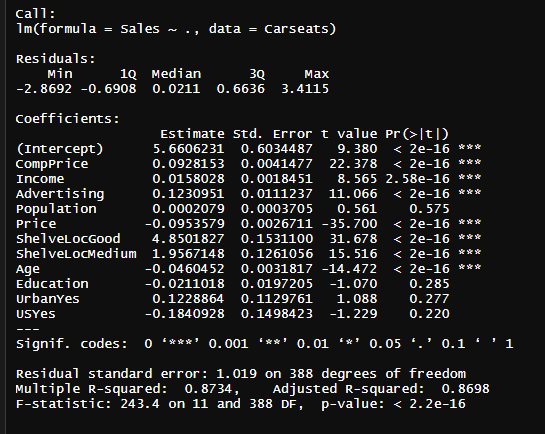

# Ejemplo 2 - Predictores cualitativos

## Objetivo

* En este ejemplo se refleja la situación en la que una variable predictiva cualitativa puede influenciar en el precio de un producto, se estima así su influencia en las ventas

## Requisitos

- Librerua ISLR

## Desarrollo

Vamos a examinar el conjunto de datos _Carseats_ de la librería ISLR, este contiene los datos sobre ventas de asientos de autos para niños, en 400 localizaciones. 

Lo primero que haremos es cargar la libreria y realizar una inspección a el conjunto de datos:

```R 
library(ISLR)

> head(Carseats)

```


Dentro del dataset se encuentra la variable _Shelveloc_, la cual contiene predictores de tipo cualitativo, está variable hace referencia a la localización del producto dentro de la tienda, calificandola con tres posibles situaciónes: _Bad_, _Medium_ y _Goog_ (Mala, Media y Buena, respectivamente en español). En este caso al realizar la regresión _R_, genera variables "dummy", automáticamente, a continuación se realiza el ajuste del modelo de regresión multiple y vemos el resumen del resultado:

```R
lm.fit <- lm( Sales ~ CompPrice +  Income + Advertising + Population + Price + ShelveLoc + Age + Education + 
                US + Urban, data = Carseats)
```

O se puede realizar con la siguiente instrucción para ahorrar escritura, la cual toma todas las variables:
```R
lm.fit <- lm(Sales ∼ . , data = Carseats)

summary(lm.fit)
```


Con el comando _Contrast()_, podemos entender como es que se generan las variable "dummy" ShelveLocGood y ShelveLocMedium , donde para la primera toma el valor de 1 cuando la localización dentro del negocio sea buena y 0 en otro caso, en ShelveLocMedium, algo similar ocurre con ShelveLocMedium, en todo caso el valor 0 corresponde a una localización mala. 
```R
> attach(Carseats)
> contrasts(ShelveLoc)
```

Lo relevante será observar los coeficientes (lm.fit$coefficients), para éstas variables ya que entre mayor sea este valor y positivo indica una mejor venta, tal es el caso del coeficiente para la variable _ShelveLocGood_, el cual indica una mayor venta entre mejor sea su localización, lo mismo ocurre para _ShelveLocMedium_, sin embargo ya que es mejor al coefiente anterior las ventas no son tan buenas como el caso anterior. 

También podemos quitar algunas variables del modelo para tratar de mejorar el ajuste, de la siguiente manera: 

```{r pressure, echo= TRUE}
 lm.fit1 <- lm(Sales ~ . - Population, data = Carseats)
 summary(lm.fit1)
```

Lo anterior se puede realizar, haciendo una actulización del modelo con el comando _update()_:

```R
lm.fit1 <- update(lm.fit , ∼ . - Population)
```

Esto produce el mismo resultado del comando anterior. Compara los modelos para tratar de determinar cual tiene mejor ajuste, ¿qué otras variables sería bueno quitar?

Adicionalmente podemos probar algunas propiedades de los residuales, como puede ser su distribución obteniendo el histograma y la varianza constante con un _scatter plot_

```R
library(ggplot2)
 library(dplyr)
 #plot(lm.fit1$residuals)
   ggplot(lm.fit1, aes(lm.fit1$residuals), ) + 
   geom_histogram(bins = 12)+ 
   labs( x= "residuals", y = "cuenta", title = "Histograma de los residuales")
 ```
 
 
 ```R
 ggplot(lm.fit1, aes(x = seq(1:length(lm.fit1$residuals)) , y = lm.fit1$residuals)) + 
   geom_point() + 
   labs( x= "index", y = "residuals", title = "Varianza de los residuales")
```


Para tener un mayor detalle se pueden realizar los gráficos asociados a los residuales 

```R
par(mfrow = c(2,2))
plot(lm.fit1)
dev.off()

```


Con estos gráficos tendremos certeza sobre el ajuste del modelo de regresión lineal multiple y podremos comprobar de igual forma las hipótesis que pide este tipo de algoritmo.
